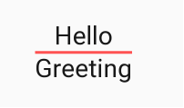

# LabelView

LabelView allows you to create lined-labeled views. 



LabelView will expand to fit the longest text. 


### Setup

Add `"https:\\jitpack.io"` as a maven url to your top-level (project) gradle file

```
allprojects {
 repositories {
    jcenter()
    maven { url "https://jitpack.io" }
 }
}
```

Add the dependency to your app gradle file

#### Pre-Android Studio 3.0
```
dependencies {
    compile 'com.github.ppetarr:Android-LabelView:v1.0.0'
}
```
#### Android Studio 3.0+
```
dependencies {
    implementation 'com.github.ppetarr:Android-LabelView:v1.0.0'
}
```

### How-to

```
 <ca.moosebytes.labelview.LabelView
      android:layout_width="wrap_content"
      android:layout_height="match_parent"
      app:textValue="Hello"
      app:labelValue="Greeting"
      app:lineColour="@color/colorPrimary"
      app:lineThickness="6"
      app:textSize="22sp"
      app:labelSize="22sp"/>
```

Change the top text:
`app:textValue` or `lblGreeting.setTextValue(String value)`

Change the label text:
`app:labelValue` or `lblGreeting.setLabelValue(String value)`

Change line colour
`app:lineColour` or `lblGreeting.setLineColour(int colour)`

Change line thickness
`app:lineThickness` or `lblGreeting.setLineThickness(float lineThickness)`

ie
```
app:textSize="50sp"
app:labelSize="28sp"
app:lineColour="@color/colorBankAccount
```
will result in;


